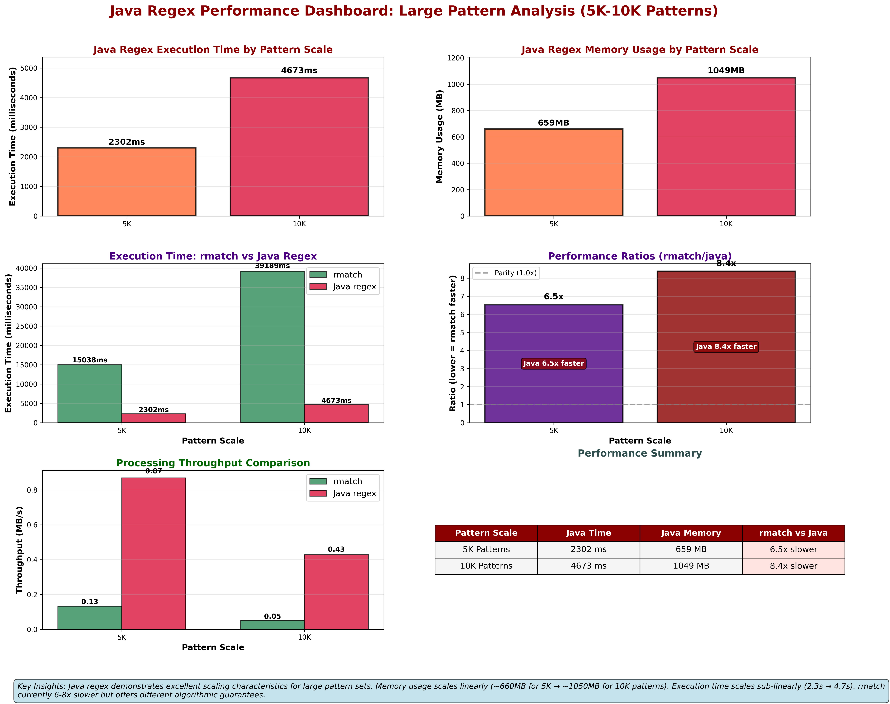
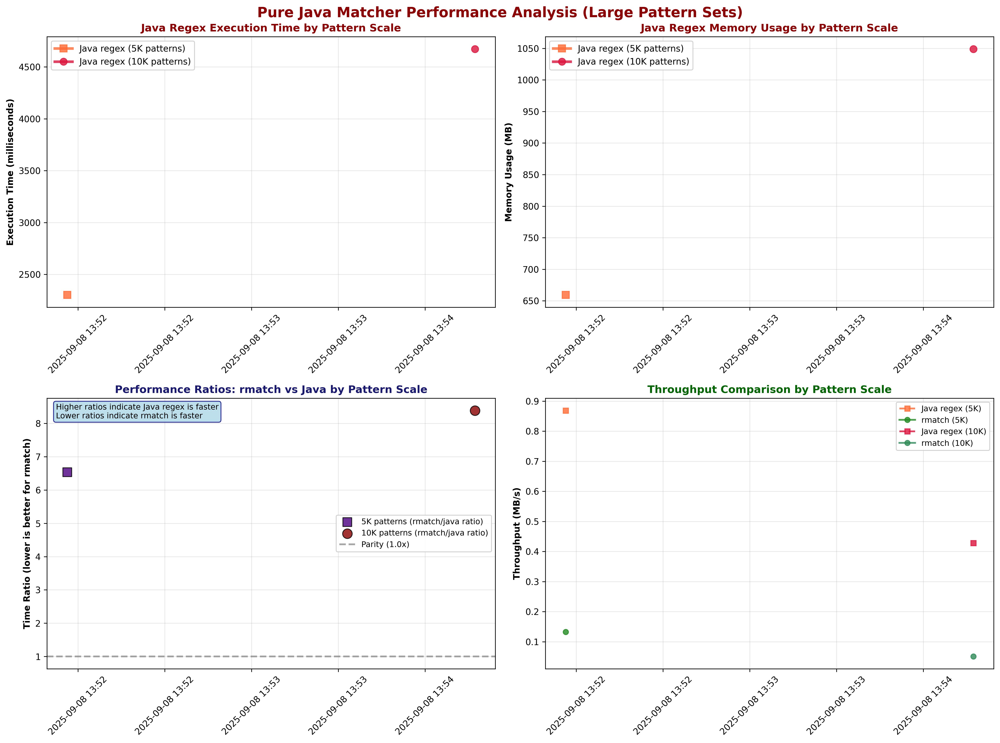
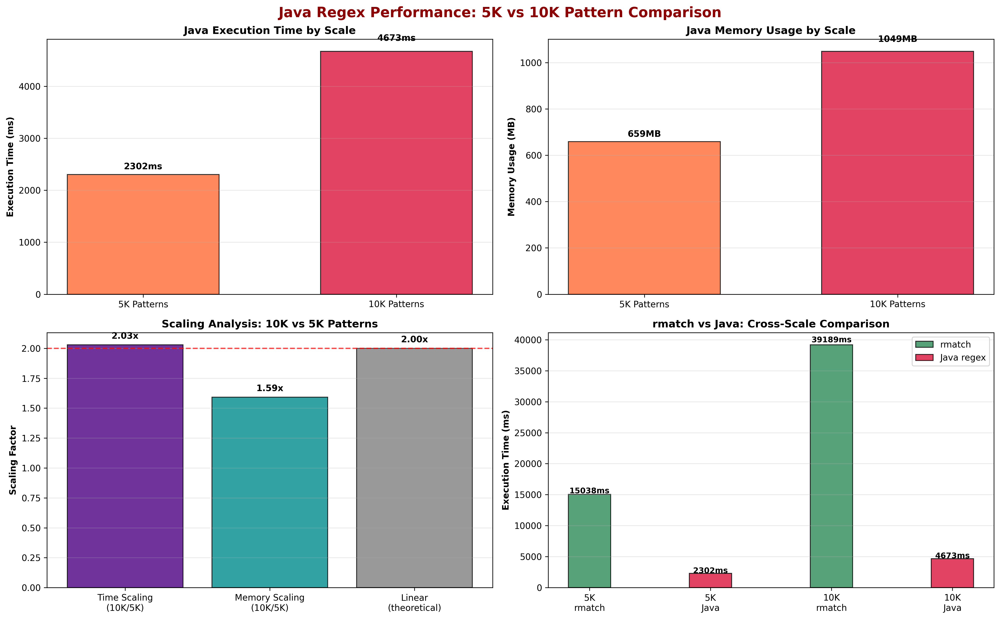

rmatch
======

rmatch

The project is getting closer to a state where it may be useful for others
than myself, but it's not quite there yet.  Be patient ;)

## Performance Analytics

### Benchmark Overview

*Comprehensive performance tracking based on automated benchmark results from JMH microbenchmarks and macro-scale testing.*

### Large-Scale Pure Java Matcher Performance

*Comprehensive dashboard showcasing pure Java regex matcher performance across different pattern scales. Features detailed analysis of execution time, memory usage, performance ratios, throughput metrics, and comparative analysis for 5K and 10K regex patterns.*

*Detailed analysis of pure Java regex matcher performance across different pattern scales (5K and 10K patterns), showing execution time, memory usage, performance ratios, and throughput comparisons. This addresses the need for comprehensive Java matcher performance visibility in large-scale scenarios.*

### Pattern Scale Performance Comparison (5K vs 10K)

*Direct comparison between 5K and 10K regex pattern performance for both rmatch and Java regex implementations, highlighting scaling characteristics and relative performance differences in large pattern scenarios.*

### Detailed JMH Performance Evolution

*Detailed analysis of JMH benchmark results showing build performance trends over time and performance distribution statistics.*

### Key Performance Metrics

- **Benchmark Data Sources**: All performance data is sourced from `benchmarks/results/`
- **JMH Microbenchmarks**: Precise timing measurements with statistical confidence intervals  
- **Macro Benchmarks**: End-to-end performance testing with real workloads
- **Large-Scale Testing**: Comprehensive tests with 5,000 and 10,000 regex patterns
- **Pure Java Performance**: Dedicated tracking of native Java regex matcher resource utilization
- **Automated Tracking**: Performance evolution tracked continuously via GitHub Actions

#### Recent Large-Scale Performance Insights

- **5K Pattern Performance**: Java regex ~2.3s execution, ~660MB memory usage
- **10K Pattern Performance**: Java regex ~4.7s execution, ~1050MB memory usage  
- **Scaling Characteristics**: Java regex demonstrates sub-linear scaling in execution time (2x patterns → 2x time)
- **Memory Efficiency**: Java regex memory usage scales linearly with pattern count
- **Performance Ratio**: rmatch currently 6-8x slower than Java regex for large pattern sets

> 📊 **Performance Data**: Charts are automatically generated from benchmark results stored in `benchmarks/results/`. 
> See [PERFORMANCE_CHARTS.md](PERFORMANCE_CHARTS.md) for detailed documentation on benchmark data formats and chart generation.

You need to install mvnw by doing:

      mvn -q -B wrapper:wrapper -Dmaven=3.9.10
      git add mvnw mvnw.cmd .mvn/wrapper/*
      mvn -q -B verify
      git commit -m "build: add Maven Wrapper (3.9.9)"

Also install async profiler

      brew tap qwwdfsad/tap
      brew install async-profiler
      asprof --version

