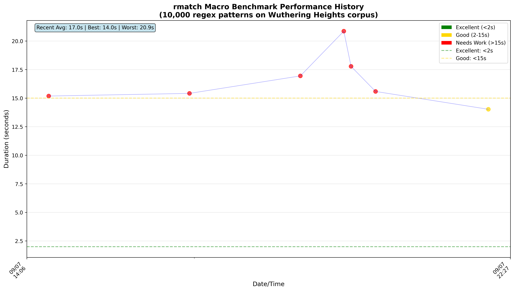
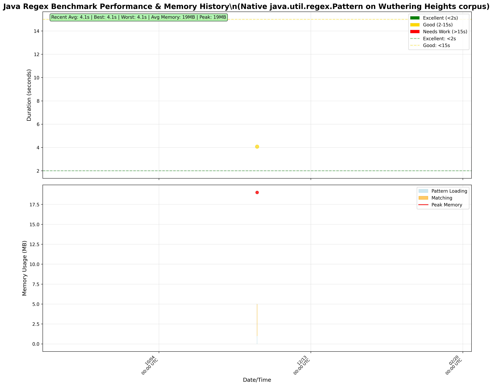
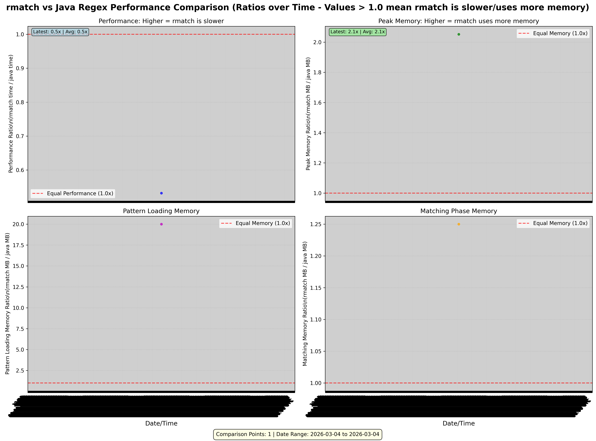

rmatch
======

## Current Performance Comparison

| Metric | rmatch | Java Regex | Ratio (rmatch/java) |
|--------|--------|------------|---------------------|
| **5000 patterns** | 19.1s | 4.2s | 4.5x slower |
| **Peak Memory** | 108MB | 19MB | 5.7x more memory |
| **Pattern Loading** | 19MB | 1MB | 19.0x more memory |
| **Matching Phase** | 74MB | 4MB | 18.5x more memory |

*Latest benchmark comparison between rmatch and native Java regex (java.util.regex.Pattern) on 5000 regex patterns against Wuthering Heights corpus. Updated: 2025-11-05 09:08 UTC*

---

## Performance Timeline Charts

### rmatch Performance History

### Java Regex Performance History  

### Performance Comparison (rmatch vs Java Regex)

*Live performance tracking from macro benchmarks. Individual charts show execution time and memory usage patterns over time, while the comparison chart shows rmatch performance ratios relative to Java regex (values > 1.0 mean rmatch is slower/uses more memory).*

---

rmatch

The project is getting closer to a state where it may be useful for others
than myself, but it's not quite there yet.  Be patient ;)

### Key Performance Metrics

- **Benchmark Data Sources**: All performance data is sourced from `benchmarks/results/`
- **JMH Microbenchmarks**: Precise timing measurements with statistical confidence intervals  
- **Macro Benchmarks**: End-to-end performance testing with real workloads
- **Automated Tracking**: Performance evolution tracked continuously via GitHub Actions

