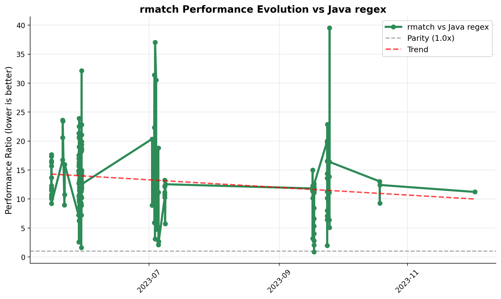

rmatch
======

rmatch

The project is getting closer to a state where it may be useful for others
than myself, but it's not quite there yet.  Be patient ;)

## Performance Evolution

*Performance evolution over time comparing rmatch vs Java regex. Lower values indicate better performance.*

You need to install mvnw by doing:

      mvn -q -B wrapper:wrapper -Dmaven=3.9.10
      git add mvnw mvnw.cmd .mvn/wrapper/*
      mvn -q -B verify
      git commit -m "build: add Maven Wrapper (3.9.9)"

Also install async profiler

      brew tap qwwdfsad/tap
      brew install async-profiler
      asprof --version

