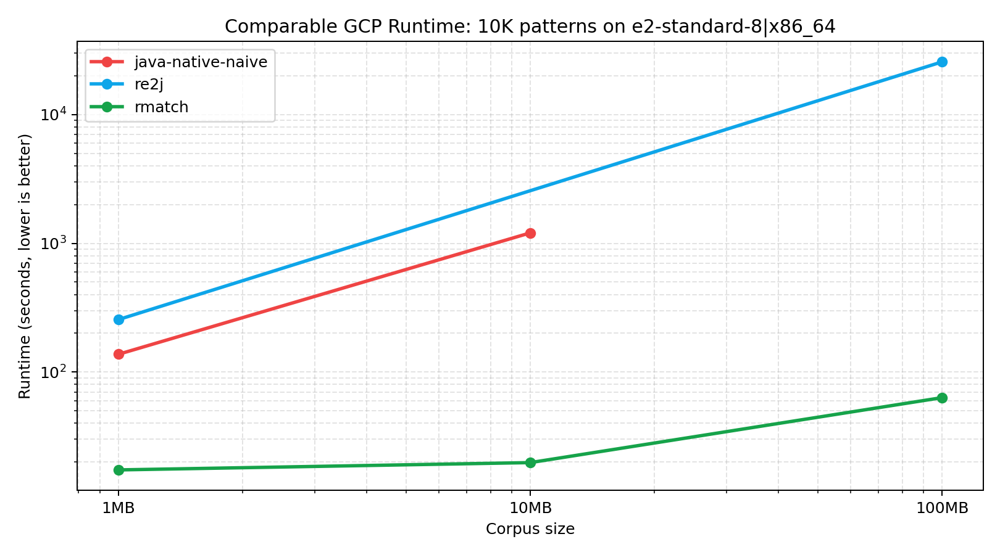
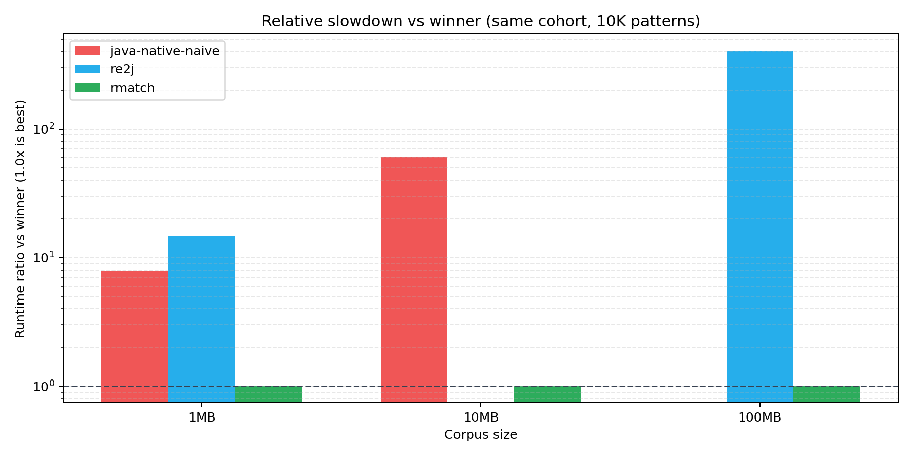
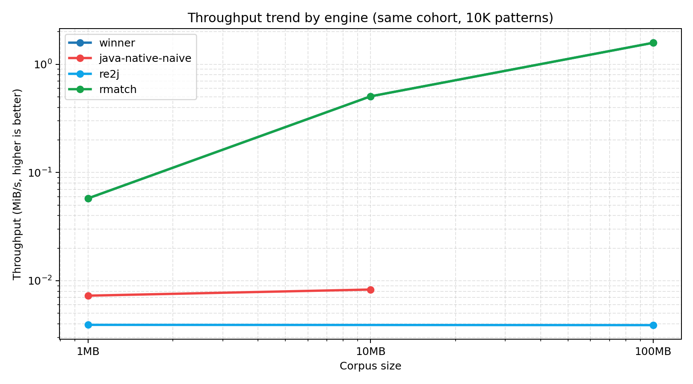

rmatch
======

## What This Library Does

- `rmatch` is a Java library for matching many regular expressions against large input buffers in one pass-oriented matching pipeline.
- It is built for high-volume multi-pattern workloads where you register many patterns once, then scan large text data efficiently and trigger callbacks on matches.
- The implementation intentionally uses a reduced regex surface syntax compared to modern Java/PCRE-style regex engines.
- This was a deliberate trade-off: prioritize core matching efficiency first, then extend syntax breadth as the engine matures.

## Example Usage

```java
import no.rmz.rmatch.impls.MatcherImpl;
import no.rmz.rmatch.utils.StringBuffer;

public class Example {
  public static void main(String[] args) throws Exception {
    MatcherImpl matcher = new MatcherImpl();

    matcher.add("ERROR|WARN", (buffer, start, end) -> {
      String match = buffer.getString(start, end);
      System.out.println("log-level match: " + match);
    });

    matcher.add("user:[a-z]+", (buffer, start, end) -> {
      System.out.println("user token match: " + buffer.getString(start, end));
    });

    matcher.match(new StringBuffer("INFO user:alice WARN disk nearly full"));
    matcher.shutdown();
  }
}
```

## Regex Syntax (Current)

The current parser supports a deliberately small core language:

- Literal text: `abc`
- Concatenation: `ab` (implicit)
- Alternation: `a|b`
- Quantifiers on previous atom: `?`, `*`, `+`
- Any single character: `.`
- Line anchors: `^`, `$`
- Character classes: `[abc]`, ranges `[a-z]`, negated classes `[^abc]`

### Important Limitations

This is **not** full Java/PCRE regex syntax today. In particular, treat the following as unsupported/not guaranteed:

- Grouping and precedence control with parentheses: `( ... )`
- Counted quantifiers: `{m}`, `{m,n}`
- Lookaround: `(?=...)`, `(?!...)`, `(?<=...)`, `(?<!...)`
- Backreferences and capture-group features
- Shorthand classes and many escapes such as `\\d`, `\\w`, `\\s`, `\\b`
- Inline flags such as `(?i)`

This reduced syntax was a conscious engineering choice to prioritize matching-engine performance work first. As the core algorithms stabilize, extending syntax coverage is a natural next step.

## Repository Navigation

- Core library: [rmatch/](rmatch/)
- Tester and harness: [rmatch-tester/](rmatch-tester/)
- Benchmark platform: [benchmarking/framework/regex_bench_framework/](benchmarking/framework/regex_bench_framework/)
- Documentation index: [docs/README.md](docs/README.md)
- Planning backlog: [docs/plans/](docs/plans/)
- Papers: [docs/papers/](docs/papers/)

## Latest Performance Tests Running 10K Regular Expression Patterns on Google Compute Node

Comparable setup used for the snapshot below:

- Same hardware cohort: `e2-standard-8|x86_64` (GCP)
- Same pattern suite: `stable_patterns` (`10,000` patterns)
- Same corpus sizes: `1MB`, `10MB`, `100MB`
- Source: [benchmarking/framework/regex_bench_framework/reports/workload_all_live/cohort_workload_engine_matrix.csv](benchmarking/framework/regex_bench_framework/reports/workload_all_live/cohort_workload_engine_matrix.csv)

| Corpus | Winner | rmatch (ms) | re2j (ms) | java-native-naive (ms) | re2j vs winner | java-native-naive vs winner |
|---|---:|---:|---:|---:|---:|---:|
| 1MB | rmatch | 17,340.1 | 255,653.6 | 137,385.1 | 14.74x | 7.92x |
| 10MB | rmatch | 19,762.0 | - | 1,205,972.5 | - | 61.02x |
| 100MB | rmatch | 63,219.3 | 25,716,382.9 | - | 406.78x | - |

`-` means no successful completed run yet for that engine/workload combination.

### Comparable Plot 1: Runtime Scaling


### Comparable Plot 2: Relative Slowdown vs Winner


### Comparable Plot 3: Throughput Trend (MiB/s; 1 MiB = 1,048,576 bytes)


More detail:

- Snapshot doc: [docs/benchmarking/LATEST_PERFORMANCE_TESTS_10K_REGEX_PATTERNS_GOOGLE_COMPUTE_NODE.md](docs/benchmarking/LATEST_PERFORMANCE_TESTS_10K_REGEX_PATTERNS_GOOGLE_COMPUTE_NODE.md)
- Interactive all-runs report: [benchmarking/framework/regex_bench_framework/reports/workload_all_live/workload_engine_comparison_all.html](benchmarking/framework/regex_bench_framework/reports/workload_all_live/workload_engine_comparison_all.html)
- Legacy front-page notes moved to:
  - [docs/benchmarking/LEGACY_FRONT_PAGE_NOTES.md](docs/benchmarking/LEGACY_FRONT_PAGE_NOTES.md)

[](https://mvnrepository.com/artifact/no.rmz/rmatch)
