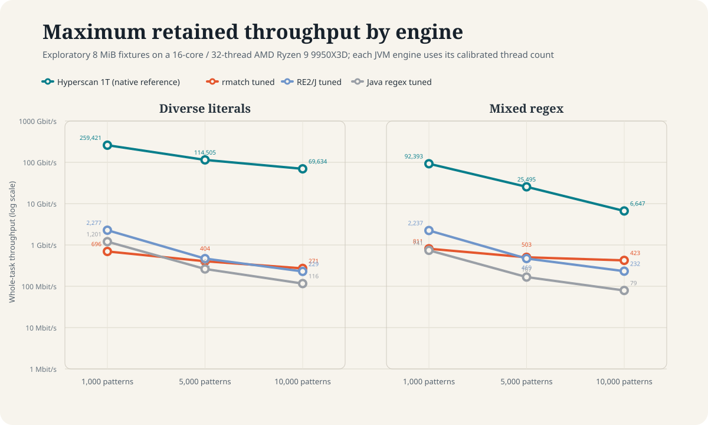

# rmatch

[](https://central.sonatype.com/artifact/no.rmz/rmatch)
[](https://javadoc.io/doc/no.rmz/rmatch)
[](https://github.com/la3lma/rmatch/actions/workflows/main-gate.yml)

`rmatch` is a Java library for matching many regular expressions against large
text buffers with one pass-oriented matching pipeline. It is aimed at workloads
where many patterns are registered once and then reused against large corpora,
for example log scanning, rule matching, and other high-volume multi-pattern
search tasks.

`1.9.x` is a pre-2.0 Maven Central release-candidate line. The engine is useful
and benchmark-positive, while the public syntax/API contract is still being
polished toward a stable `2.0.0`.

## Why Use rmatch?

The benchmark question for rmatch is not "can it beat one regex on one short
string?" It is: when many patterns must be applied to the same corpus, how does
a one-pass multi-pattern engine compare with engines that normally run one
compiled pattern at a time?

The public comparison model is:

- `java.util.regex` naive loop: compile the same pattern set, then run each
  compiled Java regex over the corpus.
- RE2J loop: compile the same pattern set with RE2J, then run each compiled
  RE2J regex over the corpus.
- rmatch: register the same pattern set in one matcher and scan the corpus once.

Current measurements use byte-identical inputs and require match counts to
agree before a timing is retained. The chart below comes from Docker runs on a
16-core / 32-thread AMD Ryzen 9 9950X3D using deterministic 8 MiB fixtures with
1,000 and 10,000 patterns. The logarithmic view keeps Hyperscan, rmatch, RE2/J,
and Java regex legible on one scale. Each line runs from 1,000 to 10,000
patterns, making the engines' different scaling profiles visible.



`1T` means one worker. The parallel RE2/J and Java lanes partition independent,
precompiled patterns across workers; rmatch is represented by its public
single-engine factory. Those are deliberately labeled as different execution
models rather than collapsed into one supposedly universal ranking. The
benchmark project contains the more detailed linear JVM view.

These are exploratory measurements from a benchmark project that is only just
getting started, not a systematic testing campaign or a final verdict. The
workloads are generated, the scenario set is still small, and wider syntax,
corpora, machines, match densities, and resource controls remain to be tested.
The harness, methodology, and auditable receipts live in the
[rmatch performance measurements project](https://github.com/la3lma/rmatch-performance-measurements).
Watch this space.

Use rmatch when the workload looks like this:

- You have hundreds, thousands, or tens of thousands of patterns.
- You apply the same pattern set to large buffers or many large documents.
- You care more about aggregate scanning throughput than PCRE-compatible syntax
  breadth.
- You can work within a regular-language subset and do not need captures,
  backreferences, or lookaround.

Do not use rmatch just because the API is pleasant. A convenient API is there
to remove adoption friction; the reason to reach for this library is the
many-pattern scaling profile.

When contributing to rmatch development, performance regression testing is part
of the work: almost all plausible matcher improvements are not improvements
until measured against the same inputs with the same correctness expectations.
The branch-vs-`main` protocol lives in
[docs/performance-regression-testing.md](docs/performance-regression-testing.md).

## Use from Maven Central

The examples below use the public API published with `1.9.5`.

Add rmatch to an existing Maven project:

```xml
<dependency>
  <groupId>no.rmz</groupId>
  <artifactId>rmatch</artifactId>
  <version>1.9.5</version>
</dependency>
```

`1.9.x` is compiled with `--release 21`, so consumers should use Java 21 or
newer. Maven Central also publishes source and Javadoc artifacts for IDEs and
API browsers.

For Gradle:

```kotlin
dependencies {
    implementation("no.rmz:rmatch:1.9.5")
}
```

## Copy-Paste Example

For a scratch project, create this structure:

```text
rmatch-demo/
  pom.xml
  src/main/java/Example.java
```

For a complete scratch project, use this full `pom.xml`:

```xml
<project xmlns="http://maven.apache.org/POM/4.0.0"
         xmlns:xsi="http://www.w3.org/2001/XMLSchema-instance"
         xsi:schemaLocation="http://maven.apache.org/POM/4.0.0 https://maven.apache.org/xsd/maven-4.0.0.xsd">
  <modelVersion>4.0.0</modelVersion>
  <groupId>demo</groupId>
  <artifactId>rmatch-demo</artifactId>
  <version>1.0.0</version>

  <properties>
    <maven.compiler.release>21</maven.compiler.release>
    <project.build.sourceEncoding>UTF-8</project.build.sourceEncoding>
  </properties>

  <dependencies>
    <dependency>
      <groupId>no.rmz</groupId>
      <artifactId>rmatch</artifactId>
      <version>1.9.5</version>
    </dependency>
  </dependencies>
</project>
```

Put this in `src/main/java/Example.java`. It registers two patterns once, scans
one buffer, and prints both matches.

```java
import no.rmz.rmatch.Matcher;
import no.rmz.rmatch.RMatch;

public class Example {
  public static void main(String[] args) throws Exception {
    try (Matcher matcher = RMatch.newMatcher()) {
      matcher.add("ERROR|WARN", (buffer, start, end) -> {
        System.out.println("log-level match: " + buffer.getString(start, end));
      });

      matcher.add("user:[a-z]+", (buffer, start, end) -> {
        System.out.println("user token match: " + buffer.getString(start, end));
      });

      matcher.match(RMatch.stringBuffer("INFO user:alice WARN disk nearly full"));
    }
  }
}
```

Run it:

```bash
mvn -q compile exec:java -Dexec.mainClass=Example
```

Expected output contains both lines. Callback order is deliberately
unspecified, even for a single-engine matcher; the production matcher may also
invoke actions concurrently:

```text
user token match: user:alice
log-level match: WARN
```

`RMatch.newMatcher()` creates the recommended production matcher. Matchers are
`AutoCloseable`; closing releases the worker threads a partitioned matcher
owns, so try-with-resources is the natural usage pattern. The callback
receives the matched buffer and half-open `[start, end)` offsets — the same
convention as `String.substring`, so the matched text is exactly
`buffer.getString(start, end)` and its length is `end - start`. rmatch
reports the longest match for each start position; overlapping matches from
different start positions may therefore be reported.

A matcher has a build-then-use lifecycle. Register every pattern before the
first call to `match()`; that first scan permanently freezes registration.
Create a replacement matcher when the rule set changes. Registering the same
`Action` object more than once for one pattern is idempotent. Two distinct
action objects remain distinct even if their `equals()` methods consider them
equal, and both are invoked for each reported match. If result order matters,
collect the callbacks and sort them explicitly.

The automatic matcher uses a hardware-based heuristic intended as a sensible
starting point, not as the best setting for every workload. Applications that
know their deployment can select the parallelism explicitly:

```java
try (Matcher matcher = RMatch.newMatcher(384)) {
    // Register patterns and scan buffers as usual.
}
```

The argument is the number of pattern partitions and the maximum number of
concurrent workers. Supported values range from `1` through `1024`; `1` uses
the single-engine matcher without a worker pool. The deliberately high ceiling
leaves room for current high-end workstations and servers, including machines
with hundreds of hardware threads. Each partition scans the same buffer with
its share of the patterns, so more workers also consume more memory bandwidth
and can make smaller workloads slower. Measure with representative patterns
and corpora rather than assuming that the largest available value is best.

`Matcher.add` throws `RegexpParserException` when a pattern is outside the
supported syntax subset, so unsupported constructs fail loudly at
registration time, never silently at match time.

### Knowing which pattern matched

The callback does not carry a pattern identifier; the action itself is the
identity. Register one action per pattern and let the closure capture
whatever identity you need:

```java
for (Rule rule : rules) {
  matcher.add(rule.pattern(), (buffer, start, end) ->
      hits.add(new Hit(rule.id(), start, end)));
}
```

Actions may run concurrently on a partitioned matcher, so collect into a
thread-safe structure (`LongAdder`, a concurrent collection, or a
synchronized block). No callback order is guaranteed.

For one small pattern against one small string, `java.util.regex` is usually the
simpler tool. rmatch is for many-pattern workloads where avoiding a separate
regex search for every pattern matters.

## Buffer Inputs and Streams

The public input helpers are named `RMatch.stringBuffer(...)`. That is an
intentional choice, not an accident of the example code: these helpers read the
whole input into a `String` and match over that materialized text.

rmatch buffers are pure content: a `Buffer` answers `hasCharAt(pos)`,
`charAt(pos)`, and `getString(start, stop)`, and holds no iteration state.
Engines keep their own cursors, which is how the partitioned matcher scans one
buffer from several threads — implementations must tolerate concurrent
readers, which immutable content does trivially. Match callbacks receive start
and end offsets, and user code commonly asks the buffer for the matched text
by offset, so content must be replayable within whatever retention window the
implementation documents.

If your input starts as a file, `Reader`, or `InputStream`, the convenience
overloads can read and decode it for you:

```java
Buffer fromString = RMatch.stringBuffer("plain text");
Buffer fromPath = RMatch.stringBuffer(path, StandardCharsets.UTF_8);
Buffer fromReader = RMatch.stringBuffer(reader);
Buffer fromStream = RMatch.stringBuffer(inputStream, StandardCharsets.UTF_8);
```

All of these forms still materialize the whole input as a `String`. The
`Buffer` contract deliberately has no total-length method: end of input is the
positional question `hasCharAt(pos)`, which a bounded-window implementation
over a long or streaming input can answer by fetching more data, restricting
`getString` to its documented lookback window. rmatch does not ship such an
adapter yet, but the interface is shaped so that it stays possible.

The escape hatch is deliberately simple: `Buffer` is public, and
`Matcher.match(Buffer)` accepts any implementation. If you want to experiment
with a file-backed, windowed, mmap-backed, or otherwise specialized input
adapter, implement `Buffer` and pass it directly to the matcher. The contract
is three methods: character lookup by position, substring lookup by half-open
range, and a positional end-of-input probe — plus tolerance for concurrent
readers.

## Supported Syntax in 1.9.x

The parser intentionally supports a reduced regular-expression language. This
is not a drop-in replacement for `java.util.regex` or PCRE.

- Literal text: `abc`
- Concatenation: `ab` (implicit)
- Alternation: `a|b`
- Quantifiers on the previous atom: `?`, `*`, `+`
- Counted quantifiers: `{m}`, `{m,n}`, `{m,}` (expansion capped at 1000)
- Grouping: `( ... )` and `(?: ... )` (equivalent; there are no captures)
- Any single character: `.` (matches every character, including newline)
- Character classes: `[abc]`, ranges `[a-z]`, negated classes `[^abc]`
- Shorthand classes: `\d`, `\D`, `\w`, `\W`, `\s`, `\S`
- Escapes: `\\`, `\.`, `\*`, `\+`, `\?`, `\[`, `\(`, `\n`, `\t`, `\r`, `\f`
- Line anchors: `^` and `$` in line-oriented mode. `^` matches at buffer start
  and after `\n`; `$` matches at EOF and before `\n`.
- Word boundaries: `\b` and `\B` using ASCII word semantics aligned with
  `\w`: letters, digits, and underscore are word characters.
- Pattern-prefix flags: `(?i)` for case-insensitive matching; `(?s)` is
  accepted because `.` is already DOTALL. Programmatic registration can use
  `matcher.add(pattern, Set.of(PatternFlag.CASE_INSENSITIVE), action)`
  instead of splicing prefixes into pattern strings

## Important Limitations

These constructs are not part of the supported `1.9.x` surface:

- Pure zero-width patterns such as `^$` are not yet part of the public support
  contract; match reporting currently assumes consumed spans.
- Lookaround: `(?=...)`, `(?!...)`, `(?<=...)`, `(?<!...)`
- Backreferences and capture-group features
- Scoped inline flags such as `a(?i)b`
- `MULTILINE` mode and a non-DOTALL `.` toggle

Backreferences are intentionally out of scope because they are non-regular.
Other limitations are candidates for the 2.0 work, especially explicit mode
semantics and pure zero-width match reporting.

## Release Notes and Roadmap

- [CHANGELOG.md](CHANGELOG.md) describes the `1.9.x` pre-release line.
- [docs/release.md](docs/release.md) documents the Maven Central release lane.
- [docs/maven-central-release-checklist.md](docs/maven-central-release-checklist.md)
  tracks the current release checklist.
- [docs/regex-syntax-roadmap.md](docs/regex-syntax-roadmap.md) tracks syntax
  coverage toward `2.0.0`.

## Repository Layout

- [rmatch/](rmatch/) contains the public library artifact `no.rmz:rmatch`.
- [rmatch-tester/](rmatch-tester/) contains local performance and experiment
  tooling; it is not part of the Maven Central release lane.
- [rmatch-perftest](https://github.com/la3lma/rmatch-perftest) contains the
  benchmark platform and multi-engine comparison harness.
- [rmatch-meta](https://github.com/la3lma/rmatch-meta) contains longer-form
  benchmark writeups, plans, and analysis papers.

## Developer Performance Workflow

Use `rmatch-perftest` for branch-vs-`main` performance checks:

1. In `rmatch` on `main`, run correctness checks and install locally:
   `./mvnw -q test && ./mvnw -q -DskipTests install`
2. In `rmatch-perftest`, run the baseline benchmark config and keep the result
   directory.
3. Switch to the candidate branch in `rmatch`, rerun the same checks, and
   install locally again.
4. In `rmatch-perftest`, rerun the exact same benchmark config, reusing the
   same pattern and corpus files.
5. Compare baseline vs candidate from the generated reports, raw JSON, or
   database artifacts. Treat the comparison as valid only when inputs and match
   counts agree.

Keeping the benchmark campaign machinery in `rmatch-perftest` keeps the Maven
library artifact small and focused.
