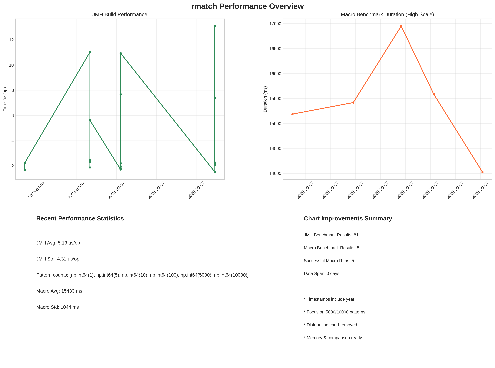

rmatch
======

## Current Performance Comparison

| Metric | rmatch | Java Regex | Ratio (rmatch/java) |
|--------|--------|------------|---------------------|
| **1000 patterns** | 2.2s | 1.6s | 1.4x slower |
| **Peak Memory** | 30MB | 15MB | 2.0x more memory |
| **Pattern Loading** | 4MB | 1MB | 4.0x more memory |
| **Matching Phase** | 12MB | 0MB | 0.0x less memory |

*Latest benchmark comparison between rmatch and native Java regex (java.util.regex.Pattern) on 1000 regex patterns against Wuthering Heights corpus. Updated: 2025-09-09 16:40 UTC*

---

## Performance Timeline Charts

### rmatch Performance History

### Java Regex Performance History  

### Performance Comparison (rmatch vs Java Regex)

*Live performance tracking from macro benchmarks. Individual charts show execution time and memory usage patterns over time, while the comparison chart shows rmatch performance ratios relative to Java regex (values > 1.0 mean rmatch is slower/uses more memory).*

---

rmatch

The project is getting closer to a state where it may be useful for others
than myself, but it's not quite there yet.  Be patient ;)

## Performance Analytics

### Benchmark Overview

*Comprehensive performance tracking based on automated benchmark results from JMH microbenchmarks and macro-scale testing.*

### Detailed JMH Performance Evolution

*Detailed analysis of JMH benchmark results showing build performance trends over time and performance distribution statistics.*

### Key Performance Metrics

- **Benchmark Data Sources**: All performance data is sourced from `benchmarks/results/`
- **JMH Microbenchmarks**: Precise timing measurements with statistical confidence intervals  
- **Macro Benchmarks**: End-to-end performance testing with real workloads
- **Automated Tracking**: Performance evolution tracked continuously via GitHub Actions

> 📊 **Performance Data**: Charts are automatically generated from benchmark results stored in `benchmarks/results/`. 
> See [PERFORMANCE_CHARTS.md](PERFORMANCE_CHARTS.md) for detailed documentation on benchmark data formats and chart generation.

You need to install mvnw by doing:

      mvn -q -B wrapper:wrapper -Dmaven=3.9.10
      git add mvnw mvnw.cmd .mvn/wrapper/*
      mvn -q -B verify
      git commit -m "build: add Maven Wrapper (3.9.9)"

Also install async profiler

      brew tap qwwdfsad/tap
      brew install async-profiler
      asprof --version

