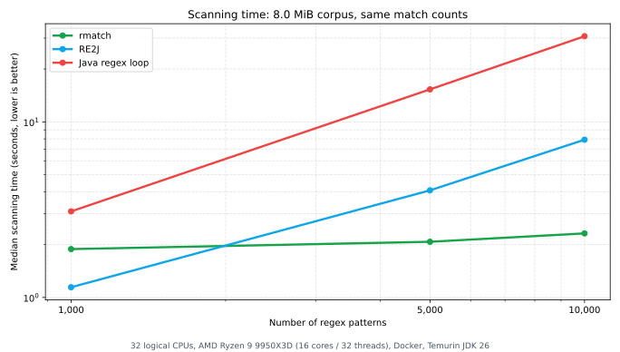

# README Efficiency Benchmark

- Machine: 32 logical CPUs, AMD Ryzen 9 9950X3D (16 cores / 32 threads), Docker, Temurin JDK 26
- Workload: deterministic literal-token patterns over corpus size(s): 8.0 MiB.
- Validation: rows are emitted only after cross-engine match counts agree.
- Metric: median scanning time over completed iterations.

| Patterns | Match count | rmatch (s) | RE2J (s) | Java regex loop (s) |
|---:|---:|---:|---:|---:|
| 1,000 | 11,000 | 1.885 | 1.143 | 3.091 |
| 5,000 | 52,721 | 2.075 | 4.073 | 15.314 |
| 10,000 | 102,721 | 2.316 | 7.914 | 30.740 |
