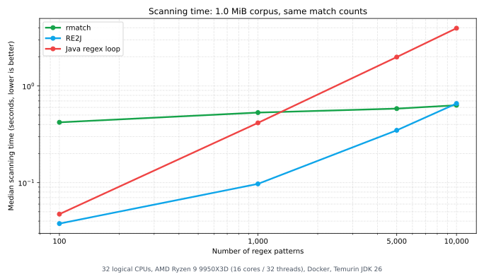

# README Efficiency Benchmark

- Machine: 32 logical CPUs, AMD Ryzen 9 9950X3D (16 cores / 32 threads), Docker, Temurin JDK 26
- Workload: deterministic literal-token patterns over corpus size(s): 1.0 MiB.
- Validation: rows are emitted only after cross-engine match counts agree.
- Metric: median scanning time over completed iterations.

| Patterns | Match count | rmatch (s) | RE2J (s) | Java regex loop (s) |
|---:|---:|---:|---:|---:|
| 100 | 12,842 | 0.421 | 0.038 | 0.047 |
| 1,000 | 12,842 | 0.531 | 0.097 | 0.415 |
| 5,000 | 12,842 | 0.583 | 0.348 | 1.991 |
| 10,000 | 12,842 | 0.632 | 0.658 | 3.956 |
